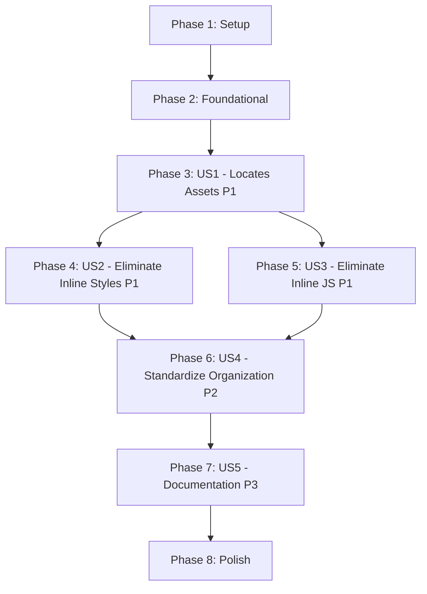

# Tasks: Web App Structure Modernization

**Input**: Design documents from `/specs/001-web-app-restructure/`
**Prerequisites**: plan.md (required), spec.md (required for user stories), research.md, data-model.md, contracts/

**Tests**: This is a refactoring task - verification is via automated checks (grep for inline styles/JS) and visual comparison. No unit/integration tests needed.

**Organization**: Tasks are grouped by user story to enable independent implementation and testing of each story.

## Format: `[ID] [P?] [Story] Description`

- **[P]**: Can run in parallel (different files, no dependencies)
- **[Story]**: Which user story this task belongs to (e.g., US1, US2, US3)
- Include exact file paths in descriptions

## Path Conventions

This is a web application refactoring:
- **Templates**: `web-app/templates/pages/`, `web-app/templates/components/`
- **CSS**: `web-app/static/css/base/`, `web-app/static/css/components/`, `web-app/static/css/pages/`, `web-app/static/css/utilities/`
- **JavaScript**: `web-app/static/js/core/`, `web-app/static/js/components/`, `web-app/static/js/pages/`, `web-app/static/js/utils/`
- **Documentation**: `web-app/docs/`

---

## Phase 1: Setup (Project Preparation)

**Purpose**: Prepare the codebase for refactoring - create directory structure and audit existing code

- [X] T001 Create new CSS directory structure: `web-app/static/css/base/`, `web-app/static/css/utilities/`, `web-app/static/css/vendor/`
- [X] T002 Create new JavaScript directory structure: `web-app/static/js/pages/`, `web-app/static/js/utils/`
- [X] T003 [P] Create documentation directory structure: `web-app/docs/`
- [X] T004 [P] Audit all inline styles: Create inventory spreadsheet of inline `style=` attributes grouped by page in `docs/refactor/inline-styles-audit.md`
- [X] T005 [P] Audit all inline JavaScript: Create inventory of inline event handlers grouped by page in `docs/refactor/inline-js-audit.md`
- [X] T006 [P] Audit existing CSS files: Document purpose of `global.css`, `style.css`, `utilities.css` in `docs/refactor/css-consolidation-plan.md`
- [X] T007 Create validation scripts: Add `scripts/validate-no-inline-styles.sh` to check for zero inline styles/JS
- [X] T008 Create screenshot directory for visual regression testing: `docs/refactor/screenshots/before/` and `docs/refactor/screenshots/after/`

---

## Phase 2: Foundational (Core Infrastructure)

**Purpose**: Establish the base structure and global asset organization that all pages will use

**⚠️ CRITICAL**: No user story work can begin until this phase is complete

- [X] T009 Create CSS reset and base styles in `web-app/static/css/base/reset.css`
- [X] T010 [P] Create CSS custom properties (variables) in `web-app/static/css/base/variables.css`
- [X] T011 [P] Create typography base styles in `web-app/static/css/base/typography.css`
- [X] T012 [P] Create layout base styles in `web-app/static/css/base/layout.css`
- [X] T013 Move Tailwind CSS to vendor directory: `web-app/static/css/tailwind.output.css` → `web-app/static/css/vendor/tailwind.output.css`
- [X] T014 Consolidate spacing utilities from `utilities.css` into `web-app/static/css/utilities/spacing.css`
- [X] T015 [P] Create color utilities in `web-app/static/css/utilities/colors.css`
- [X] T016 [P] Create flexbox utilities in `web-app/static/css/utilities/flexbox.css`
- [X] T017 [P] Create visibility utilities in `web-app/static/css/utilities/visibility.css`
- [X] T018 Update `base.html` to load new CSS file structure (vendor → base → utilities → components → page blocks)
- [X] T019 Move existing `main.js` to `web-app/static/js/core/main.js`
- [X] T020 Update `base.html` to load JS from new structure (`core/main.js`, component blocks, page blocks)

**Checkpoint**: Foundation ready - CSS/JS directory structure established, base.html updated

---

## Phase 3: User Story 1 - Frontend Developer Locates Assets Quickly (Priority: P1) 🎯 MVP

**Goal**: Establish clear 1:1 mapping between templates and CSS/JS files so developers can locate any component's styles in under 30 seconds

**Independent Test**: Time how long it takes to find the CSS file for avatars.html. Success = finding `static/css/pages/avatars.css` in under 30 seconds by navigating the directory structure.

**Strategy**: Create CSS and JS files for all 25 page templates and 3 components, following the naming convention (template name = CSS/JS name). Start empty - content extraction happens in US2/US3.

### Implementation for User Story 1

#### Create Page CSS Files (Parallel)

- [ ] T021 [P] [US1] Create empty `web-app/static/css/pages/index.css`
- [ ] T022 [P] [US1] Create empty `web-app/static/css/pages/avatars.css`
- [ ] T023 [P] [US1] Create empty `web-app/static/css/pages/elo.css`
- [ ] T024 [P] [US1] Create empty `web-app/static/css/pages/elo_global.css`
- [ ] T025 [P] [US1] Create empty `web-app/static/css/pages/elo_server.css`
- [ ] T026 [P] [US1] Create empty `web-app/static/css/pages/elements.css`
- [ ] T027 [P] [US1] Create empty `web-app/static/css/pages/card.css`
- [ ] T028 [P] [US1] Create empty `web-app/static/css/pages/cards.css`
- [ ] T029 [P] [US1] Create empty `web-app/static/css/pages/avatar.css`
- [ ] T030 [P] [US1] Create empty `web-app/static/css/pages/community.css`
- [ ] T031 [P] [US1] Create empty `web-app/static/css/pages/deck_help.css`
- [ ] T032 [P] [US1] Create empty `web-app/static/css/pages/fart_leaderboard.css`
- [ ] T033 [P] [US1] Create empty `web-app/static/css/pages/help.css`
- [ ] T034 [P] [US1] Create empty `web-app/static/css/pages/about.css`
- [ ] T035 [P] [US1] Create empty `web-app/static/css/pages/admin_audit_log.css`

#### Create Page JS Files (Parallel - only for interactive pages)

- [ ] T036 [P] [US1] Create empty `web-app/static/js/pages/avatars.js` (has filters, charts)
- [ ] T037 [P] [US1] Create empty `web-app/static/js/pages/elo.js` (has charts)
- [ ] T038 [P] [US1] Create empty `web-app/static/js/pages/elements.js` (has filters)
- [ ] T039 [P] [US1] Create empty `web-app/static/js/pages/admin_audit_log.js` (has filters)

#### Update Templates to Load Assets

- [ ] T040 [US1] Update `web-app/templates/pages/index.html` to load `` with `css/pages/index.css`
- [ ] T041 [US1] Update `web-app/templates/pages/avatars.html` to load `css/pages/avatars.css` and `js/pages/avatars.js`
- [ ] T042 [US1] Update `web-app/templates/pages/elo.html` to load `css/pages/elo.css` and `js/pages/elo.js`
- [ ] T043 [US1] Update all remaining page templates to load their corresponding CSS/JS files in ``

#### Validation

- [ ] T044 [US1] Run validation script: Verify all page templates have matching CSS files (naming consistency check)
- [ ] T045 [US1] Document file naming convention in `web-app/docs/frontend-structure.md` with examples
- [ ] T046 [US1] Test developer experience: Time how long it takes to find avatars.css (target: <30 seconds)

**Checkpoint**: All templates have clearly named, matching CSS/JS files that can be located predictably

---

## Phase 4: User Story 2 - Eliminate Inline Styles from Templates (Priority: P1)

**Goal**: Extract all 181+ inline `style=` attributes from templates to external CSS files

**Independent Test**: Run `grep -r 'style=' web-app/templates/ --include="*.html" | wc -l` and verify result is 0 (or only approved exceptions for truly dynamic styles)

**Strategy**: Extract inline styles page-by-page, starting with the largest/most complex pages (highest impact first)

### Large Pages (High Impact)

- [ ] T047 [US2] Screenshot `avatars.html` current state → `docs/refactor/screenshots/before/avatars.png`
- [ ] T048 [US2] Extract ~90 inline styles from `web-app/templates/pages/avatars.html` to `web-app/static/css/pages/avatars.css`
- [ ] T049 [US2] Screenshot `avatars.html` after refactor → `docs/refactor/screenshots/after/avatars.png`
- [ ] T050 [US2] Visual comparison of avatars.html (before/after) and manual testing (filters, sort, charts work)
- [ ] T051 [US2] Verify zero inline styles in avatars.html: `grep 'style=' templates/pages/avatars.html` → 0 results
- [ ] T052 [US2] Screenshot `elo.html` current state → `docs/refactor/screenshots/before/elo.png`
- [ ] T053 [US2] Extract ~40 inline styles from `web-app/templates/pages/elo.html` to `web-app/static/css/pages/elo.css`
- [ ] T054 [US2] Visual comparison of elo.html and test charts render correctly
- [ ] T055 [US2] Verify zero inline styles in elo.html
- [ ] T056 [US2] Screenshot `elements.html` current state → `docs/refactor/screenshots/before/elements.png`
- [ ] T057 [US2] Extract ~30 inline styles from `web-app/templates/pages/elements.html` to `web-app/static/css/pages/elements.css`
- [ ] T058 [US2] Visual comparison of elements.html and test filters work
- [ ] T059 [US2] Verify zero inline styles in elements.html

### Medium Pages

- [ ] T060 [US2] Extract inline styles from `web-app/templates/pages/card.html` to `web-app/static/css/pages/card.css`
- [ ] T061 [US2] Extract inline styles from `web-app/templates/pages/cards.html` to `web-app/static/css/pages/cards.css`
- [ ] T062 [US2] Extract inline styles from `web-app/templates/pages/avatar.html` to `web-app/static/css/pages/avatar.css`
- [ ] T063 [US2] Extract inline styles from `web-app/templates/pages/community.html` to `web-app/static/css/pages/community.css`
- [ ] T064 [US2] Extract inline styles from `web-app/templates/pages/admin_audit_log.html` to `web-app/static/css/pages/admin_audit_log.css`
- [ ] T065 [US2] Visual comparison and validation for medium pages (card, cards, avatar, community, admin_audit_log)

### Simple Pages

- [ ] T066 [P] [US2] Extract inline styles from `web-app/templates/pages/about.html` to `web-app/static/css/pages/about.css`
- [ ] T067 [P] [US2] Extract inline styles from `web-app/templates/pages/help.html` to `web-app/static/css/pages/help.css`
- [ ] T068 [P] [US2] Extract inline styles from `web-app/templates/pages/deck_help.html` to `web-app/static/css/pages/deck_help.css`
- [ ] T069 [P] [US2] Extract inline styles from `web-app/templates/pages/fart_leaderboard.html` to `web-app/static/css/pages/fart_leaderboard.css`
- [ ] T070 [P] [US2] Extract inline styles from remaining simple pages (index, elo_global, elo_server, error pages)

### Components

- [ ] T071 [US2] Extract inline styles from `web-app/templates/components/navbar.html` (if any) to `web-app/static/css/components/navbar.css`
- [ ] T072 [US2] Extract inline styles from `web-app/templates/components/footer.html` (if any) to `web-app/static/css/components/footer.css`
- [ ] T073 [US2] Extract inline styles from `web-app/templates/components/` remaining components

### Consolidate Repeated Styles

- [ ] T074 [US2] Identify repeated styles across multiple pages (e.g., `.card-container` appears 10+ times)
- [ ] T075 [US2] Move repeated styles to utilities: Create utility classes in `web-app/static/css/utilities/` for common patterns
- [ ] T076 [US2] Update templates to use utility classes instead of duplicated page-specific CSS

### Global Validation

- [ ] T077 [US2] Run global validation: `grep -r 'style=' web-app/templates/ --include="*.html" | wc -l` → verify 0 or only approved exceptions
- [ ] T078 [US2] Document approved exceptions (dynamic URLs, gradients from DB) in `docs/refactor/approved-inline-styles.md`
- [ ] T079 [US2] Calculate template file size reduction: Compare before/after (target: 30-40% reduction)

**Checkpoint**: Zero inline styles in templates - all styling is in external CSS files

---

## Phase 5: User Story 3 - Eliminate Inline JavaScript from Templates (Priority: P1)

**Goal**: Extract all 15+ inline event handlers (`onclick`, `onchange`, etc.) from templates to external JavaScript files

**Independent Test**: Run `grep -rE 'on(click|change|load|input|submit)=' web-app/templates/ --include="*.html" | wc -l` and verify result is 0

**Strategy**: Extract inline handlers page-by-page using event delegation pattern

### Large Interactive Pages

- [ ] T080 [US3] Extract ~6 inline handlers from `web-app/templates/pages/avatars.html` to `web-app/static/js/pages/avatars.js`
- [ ] T081 [US3] Implement event delegation for avatars.html (filter dropdown, sort selector, chart controls)
- [ ] T082 [US3] Replace inline `onclick` with `data-action` attributes in avatars.html
- [ ] T083 [US3] Test all interactive features in avatars.html (filters, sorting, chart updates)
- [ ] T084 [US3] Verify zero inline handlers in avatars.html: `grep -E 'onclick=' templates/pages/avatars.html` → 0
- [ ] T085 [US3] Extract ~3 inline handlers from `web-app/templates/pages/elo.html` to `web-app/static/js/pages/elo.js`
- [ ] T086 [US3] Implement event delegation for elo.html (chart controls, filters)
- [ ] T087 [US3] Test chart rendering and controls in elo.html
- [ ] T088 [US3] Verify zero inline handlers in elo.html

### Medium Interactive Pages

- [ ] T089 [US3] Extract inline handlers from `web-app/templates/pages/elements.html` to `web-app/static/js/pages/elements.js`
- [ ] T090 [US3] Implement event delegation for elements.html (filter controls)
- [ ] T091 [US3] Extract inline handlers from `web-app/templates/pages/admin_audit_log.html` to `web-app/static/js/pages/admin_audit_log.js`
- [ ] T092 [US3] Test admin_audit_log.html filters work correctly
- [ ] T093 [US3] Verify zero inline handlers in elements.html and admin_audit_log.html

### Remaining Pages

- [ ] T094 [P] [US3] Extract any remaining inline handlers from other pages to their corresponding JS files
- [ ] T095 [P] [US3] Wrap all page JavaScript in `DOMContentLoaded` event listeners
- [ ] T096 [P] [US3] Add `defer` attribute to all `<script>` tags in templates

### Global Validation

- [ ] T097 [US3] Run global validation: `grep -rE 'on(click|change|load|input)=' web-app/templates/ --include="*.html" | wc -l` → verify 0
- [ ] T098 [US3] Test all pages in browser: Check console for JavaScript errors (should be 0)
- [ ] T099 [US3] Document event delegation pattern in `web-app/docs/javascript-patterns.md`

**Checkpoint**: Zero inline JavaScript handlers - all interactivity is in external JS files with event delegation

---

## Phase 6: User Story 4 - Standardize Asset Organization (Priority: P2)

**Goal**: Consolidate and reorganize global CSS files into clear categories (base/, utilities/, vendor/)

**Independent Test**: Verify all CSS files are in one of: base/, components/, pages/, utilities/, vendor/ - no orphan files in static/css/ root

**Strategy**: Audit existing global files, consolidate into new structure, delete legacy files

### Consolidate Global CSS

- [ ] T100 [US4] Audit `web-app/static/css/global.css`: Document all rules and categorize (reset/typography/layout/other)
- [ ] T101 [US4] Migrate reset rules from global.css to `web-app/static/css/base/reset.css`
- [ ] T102 [US4] Migrate typography rules from global.css to `web-app/static/css/base/typography.css`
- [ ] T103 [US4] Migrate layout rules from global.css to `web-app/static/css/base/layout.css`
- [ ] T104 [US4] Delete `web-app/static/css/global.css` (now empty - all rules migrated)

### Audit and Consolidate style.css (Legacy Catch-All)

- [ ] T105 [US4] Audit `web-app/static/css/style.css`: Categorize all 25KB of rules
- [ ] T106 [US4] Move page-specific styles from style.css to `web-app/static/css/pages/[page].css`
- [ ] T107 [US4] Move component styles from style.css to `web-app/static/css/components/[component].css`
- [ ] T108 [US4] Move utility styles from style.css to `web-app/static/css/utilities/[category].css`
- [ ] T109 [US4] Delete `web-app/static/css/style.css` (now empty - all rules migrated)

### Consolidate utilities.css

- [ ] T110 [US4] Audit `web-app/static/css/utilities.css`: Verify all rules are utilities
- [ ] T111 [US4] Keep utilities.css or split into specific files (spacing, colors, etc.) based on size
- [ ] T112 [US4] Remove any duplicate utilities that Tailwind already provides

### Verification

- [ ] T113 [US4] Verify directory structure: All CSS files are in base/, components/, pages/, utilities/, or vendor/
- [ ] T114 [US4] Update base.html CSS load order: vendor → base → utilities → components → pages
- [ ] T115 [US4] Test all pages still render correctly after CSS reorganization
- [ ] T116 [US4] Document CSS organization in `web-app/docs/frontend-structure.md`

**Checkpoint**: CSS files organized into clear categories - no legacy catch-all files remain

---

## Phase 7: User Story 5 - Documentation for New Structure (Priority: P3)

**Goal**: Create comprehensive documentation so new developers can add pages following the structure in under 15 minutes

**Independent Test**: Ask a new developer (or simulate) to add a test page following only the documentation. Success = files created in correct locations without guidance.

### Create Documentation

- [ ] T117 [P] [US5] Write developer guide in `web-app/docs/frontend-structure.md` (overview, folder structure, conventions)
- [ ] T118 [P] [US5] Copy quickstart guide from specs to `web-app/docs/quickstart-new-page.md`
- [ ] T119 [P] [US5] Copy frontend conventions contract to `web-app/docs/frontend-conventions.md`
- [ ] T120 [P] [US5] Create new page template boilerplate in `web-app/docs/templates/new-page-template.html`
- [ ] T121 [P] [US5] Create CSS boilerplate template in `web-app/docs/templates/new-page-css-template.css`
- [ ] T122 [P] [US5] Create JavaScript boilerplate template in `web-app/docs/templates/new-page-js-template.js`

### Create Validation Tools

- [ ] T123 [US5] Create pre-commit hook script `scripts/validate-frontend.sh` (checks inline styles/JS, naming conventions)
- [ ] T124 [US5] Document validation commands in `web-app/docs/validation.md` (grep commands, compliance checks)

### Create PR Checklist

- [ ] T125 [US5] Add frontend section to `.github/PULL_REQUEST_TEMPLATE.md` with 12-item checklist from contract
- [ ] T126 [US5] Document exception request process in `web-app/docs/frontend-conventions.md`

### Test Documentation

- [ ] T127 [US5] Simulate new developer workflow: Create test page `test-doc-page.html` following only the documentation
- [ ] T128 [US5] Verify test page files created in correct locations (templates/pages/, static/css/pages/, static/js/pages/)
- [ ] T129 [US5] Delete test page after verification
- [ ] T130 [US5] Measure time to complete test workflow (target: <15 minutes)

**Checkpoint**: Complete documentation exists - new developers can self-serve when adding pages

---

## Phase 8: Polish & Cross-Cutting Concerns

**Purpose**: Final improvements, cleanup, and verification

- [ ] T131 [P] Add file header comments to all CSS files (purpose, template path, description)
- [ ] T132 [P] Add JSDoc comments to all JavaScript files (purpose, template path, functions)
- [ ] T133 Review all templates for consistent formatting (proper indentation, no trailing whitespace)
- [ ] T134 Optimize CSS: Remove unused styles, consolidate duplicates (use PurgeCSS or manual audit)
- [ ] T135 [P] Update CLAUDE.md to document new frontend structure and conventions
- [ ] T136 [P] Update web-app README with link to frontend documentation
- [ ] T137 Run final global validation: Zero inline styles, zero inline JS, all files in correct categories
- [ ] T138 Performance audit: Measure page load times before/after (should be equal or better)
- [ ] T139 Calculate final metrics: Template file size reduction, CSS organization (files per category)
- [ ] T140 Create before/after comparison document in `docs/refactor/results.md` (metrics, screenshots, lessons learned)

---

## Dependencies & Execution Order

### Phase Dependencies

- **Setup (Phase 1)**: No dependencies - can start immediately
- **Foundational (Phase 2)**: Depends on Setup completion - BLOCKS all user stories
- **User Stories (Phase 3-7)**: All depend on Foundational phase completion
  - **US1** (P1): Can start after Foundational - No dependencies on other stories
  - **US2** (P1): Can start after US1 completion (needs CSS files to exist) - Independent of US3
  - **US3** (P1): Can start after US1 completion (needs JS files to exist) - Independent of US2
  - **US4** (P2): Should wait for US2/US3 completion (easier to reorganize after extraction done)
  - **US5** (P3): Should wait for US2/US3/US4 completion (document final structure)
- **Polish (Phase 8)**: Depends on all user stories being complete

### User Story Dependencies



### Critical Path

```
Setup → Foundational → US1 → US2/US3 (parallel) → US4 → US5 → Polish
```

### Parallel Opportunities

**Within Setup (Phase 1)**:
- T003-T006 can all run in parallel (documentation and audits)

**Within Foundational (Phase 2)**:
- T010-T012 (CSS base files) can run in parallel
- T014-T017 (utility files) can run in parallel
- T019 can run in parallel with CSS tasks

**Within US1 (Phase 3)**:
- T021-T035 (all CSS file creation) can run in parallel
- T036-T039 (all JS file creation) can run in parallel
- T040-T043 (template updates) must be sequential or carefully coordinated

**Within US2 (Phase 4)**:
- Large pages must be sequential (to validate each)
- Medium pages can be grouped and parallelized
- T066-T070 (simple pages) can all run in parallel

**Within US3 (Phase 5)**:
- T094-T096 can run in parallel (different pages)

**Within US5 (Phase 7)**:
- T117-T122 (all documentation) can run in parallel

**Within Polish (Phase 8)**:
- T131-T132, T135-T136 can run in parallel

---

## Parallel Example: User Story 2 (Eliminate Inline Styles)

```bash
# After completing large pages sequentially, parallelize simple pages:
Task: "Extract inline styles from about.html to css/pages/about.css"
Task: "Extract inline styles from help.html to css/pages/help.css"
Task: "Extract inline styles from deck_help.html to css/pages/deck_help.css"
Task: "Extract inline styles from fart_leaderboard.html to css/pages/fart_leaderboard.css"
# All work on different files, no conflicts
```

---

## Implementation Strategy

### MVP First (User Stories 1-3 Only)

**Goal**: Achieve core value - zero inline styles/JS, findable assets

1. Complete Phase 1: Setup (T001-T008)
2. Complete Phase 2: Foundational (T009-T020)
3. Complete Phase 3: User Story 1 (T021-T046)
   - **VALIDATE**: Can locate avatars.css in <30 seconds
4. Complete Phase 4: User Story 2 (T047-T079)
   - **VALIDATE**: `grep 'style=' → 0 results`
5. Complete Phase 5: User Story 3 (T080-T099)
   - **VALIDATE**: `grep 'onclick=' → 0 results`
6. **STOP - Deploy MVP**: Core refactoring complete, 100% of inline code eliminated

### Full Feature Delivery

1. Complete MVP (Phases 1-5)
2. Complete Phase 6: User Story 4 (T100-T116)
   - **VALIDATE**: CSS organized into clear categories
3. Complete Phase 7: User Story 5 (T117-T130)
   - **VALIDATE**: New developer can add page in <15 minutes
4. Complete Phase 8: Polish (T131-T140)
   - **VALIDATE**: All metrics achieved

### Incremental Deployment

**After Each Page Refactor** (within US2/US3):
- Commit with message: "Refactor [page].html: extract inline styles/JS"
- Can deploy incrementally (each page refactor is safe and independent)

**After Each User Story**:
- US1 complete → Developers can find files quickly
- US2 complete → Zero inline styles
- US3 complete → Zero inline JavaScript
- US4 complete → Organized file structure
- US5 complete → Self-service documentation

---

## Task Summary

**Total Tasks**: 140
**Parallelizable Tasks**: 52 (marked with [P])

**Tasks by User Story**:
- Setup (Phase 1): 8 tasks
- Foundational (Phase 2): 12 tasks
- US1 - Locates Assets (Phase 3): 26 tasks (15 parallel)
- US2 - Eliminate Inline Styles (Phase 4): 33 tasks (8 parallel)
- US3 - Eliminate Inline JS (Phase 5): 20 tasks (3 parallel)
- US4 - Standardize Organization (Phase 6): 17 tasks
- US5 - Documentation (Phase 7): 14 tasks (6 parallel)
- Polish (Phase 8): 10 tasks (5 parallel)

**Success Metrics Targets** (from spec.md):
- ✅ Time to locate component styles: <30 seconds (baseline: 2-3 min)
- ✅ Inline style attributes: 0 (baseline: 181+)
- ✅ Inline JS handlers: 0 (baseline: 15+)
- ✅ Template file sizes: -30-40% reduction
- ✅ Code review time: -40% improvement
- ✅ New developer onboarding: <15 minutes

**MVP Scope** (Phases 1-5):
- 99 tasks to deliver core value
- Achieves primary goal: zero inline styles/JS
- All pages refactored, assets findable

**Full Feature Scope** (All Phases):
- 140 tasks total
- Includes organization, documentation, polish
- Fully maintainable structure with self-service docs

---

## Notes

- [P] tasks = different files, no dependencies
- [Story] label maps task to specific user story for traceability
- Each user story should be independently completable and testable
- Commit after each page refactor or logical group of tasks
- Stop at any checkpoint to validate independently
- Avoid: vague tasks, same file conflicts, rushing large pages without visual validation
- Use validation scripts frequently: `scripts/validate-no-inline-styles.sh`
- Document all approved exceptions (dynamic styles) in `docs/refactor/approved-inline-styles.md`
